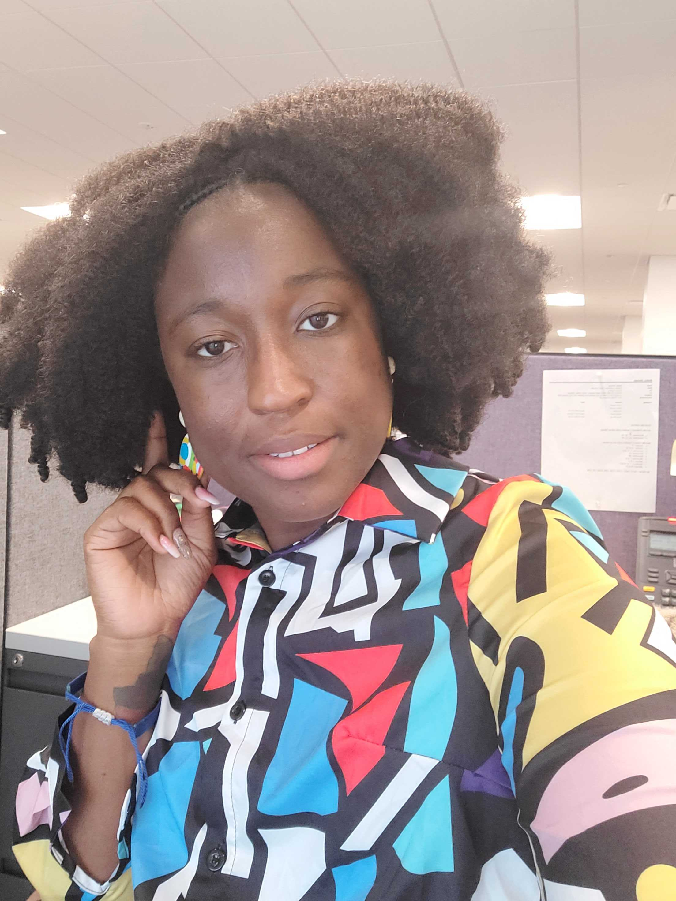

#  YouTube Clone Project

<h1>Group Members</h1>
<ul>

<li><a href="https://github.com/zalazimovr">Zalman Azimov</a></li>
<li><a href="https://github.com/JenniferPeterson1203">Jennifer Peterson</a></li>

</ul>

# About:::

Our collaborative group project has been a remarkable journey of teamwork and synergy among all members. We embarked on this project by establishing effective communication channels and task management systems. We utilized a Trello board to track our progress, coordinated our efforts through GitHub commits, and efficiently divided the workload. This experience has not only been a tremendous learning opportunity but also an essential aspect of our field.

With great pride, we present our project: a React application designed to leverage the YouTube API for seamless video searches. Our aim is to provide users with an immersive video browsing experience, allowing them to choose and watch videos from a curated selection.

## Instructions

<ol>
<li>
 Navigate to the search bar: On the YouTube homepage, you will find a search bar located at the top of the page.
</li>
<li>Enter your search query: Type the keywords or the title of the video you want to find into the search bar. For example, you can search for "funny cat videos."</li>
<li>Click on the search icon: Next to the search bar, there is a magnifying glass icon. Click on it or press Enter on your keyboard to initiate the search.</li>
<li>Browse the search results: YouTube will display a list of videos related to your search query. You can scroll down to view more videos. Each video will have a thumbnail image, title and channel name.</li>
<li>Click on a video: When you find a video that interests you, click on its thumbnail or title. This will take you to the video's dedicated page.</li>
<li>Watch the video: On the video page, you will see the video player in the center of the screen. Press the play button to start watching the video.</li>
<li>Interact with the video: While watching the video, you can perform various actions. You can pause or resume the video by clicking the play/pause button on the video player. You can also adjust the volume, switch to full screen mode, or enable captions using the options available on the video player.</li>
<li>Navigate back to search results or find more videos: To go back to the search results, you can use the back button on your browser or click the YouTube logo at the top left corner of the page. You can continue exploring more videos by clicking on the recommendations or by performing a new search using the search bar.</li>
<li>Most importantly, ENJOY!! 😁</li>
</ol>

<a href="https://trello.com/b/ZbMUafvG">Trello</a>

<a href="https://zalazimov.github.io/project-youtube-clone/">GitHub Repository</a>

<a href="https://jenn-and-zalman-youtube.netlify.app/">Netlify</a>

 

Zalman A. & Jennifer P.

